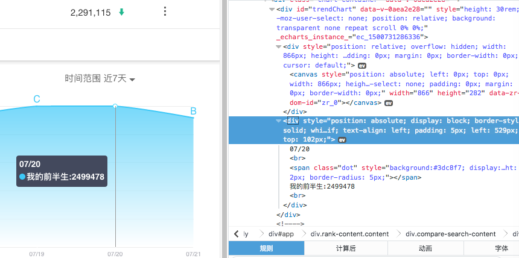

# 百度指数手机版数据加密分析

## 前言

暑假跟着研究生学长学姐们学习 python 的时候，说要爬取百度指数的数据，听二狗大神讲百度指数的网页数据显示简直变态，是用 css 控制图片位置拼接而成的。他还有个软件可以爬取，用的是截图之后 OCR 的方式，不是精确数字，并且一毛钱一个关键词，好坑。去网页版看了一下，选择放弃（过几天再试试）。于是转战手机版网页。
电脑版与手机版均需要登录才可以查看数据页面。

## 显示
手机版的看起来很友好，鼠标移动到一个点，就会显示数据，审查元素发现是 js 操作 dom 更新的数据，是以文本形式显示的。

于是想来抓包看看后台传来的数据，果然是 ajax 

## 抓包
刷新页面，发现有`getIndex?`请求，某次返回数据如下：

```json
{
  "status": 0,
  "uniqid": "59735796d9df36.62370032",
  "data": [
    {
      "key": "\u6211\u7684\u524d\u534a\u751f",
      "index": [
        {
          "period": "20170715|20170721",
          "_all": "x0yYhyNe3zHRzhze3x3hNzxe3NzH0zRe3yh030xe3yhhyR0e33hxxxH",
          "_pc": "3HxN30e3Yhh33eNHxNhheNY3y03eNhzh3yeyzN3HyeNyRYN3",
          "_wise": "xHhHYxHexR0RxY0exRRRhz3exhyNN3He3xzRNHRe3zhY33yexhyNy0N"
        }
      ]
    }
  ]
}
```

对应页面上的“PC+移动”、“PC”、“移动端”，可以猜测出来几个字段的含义

```json
{
    "period": "起止日期",
    "_all": "PC+移动数据",
    "_pc": "PC数据",
    "_wise": "移动端数据"
}
```

不难看出是加密了的（废话）
然后我又放弃了，心想移动鼠标的时候页面显示数据，干脆用 selenium + phantomjs 模拟鼠标动作算了，折腾了好大一会，跟着《Python 网络数据采集》写了几行代码试了一下，速度太慢（主要还是自己太菜了），再次放弃。

## 再次抓包
想来自己还有一点 js 基础，何不尝试一下分析它的加密算法呢？于是再次分析一下打开页面时的网络请求，发现一点新东西了。
每次刷新页面时，`getIndex?` 请求后，都会跟着一个 `ptbk?uniqid=` 请求，返回数据如下：

```json
{
  "status": 0,
  "data": "xYNLyR0ie3zHCvh163+478%,205-.9"
}
```

并且发现：`ptbk?uniqid=` 请求只有一个参数```uniqid```，而这个参数存在于`getIndex?` 请求返回的数据中。所以推测`ptbk?uniqid=` 请求返回的数据应该是解密的密钥。

## 请求
##### getIndex? 请求
###### url
`http://index.baidu.com/Interface/Newwordgraph/getIndex`
###### headers
测试发现请求头可以舍弃。

```json
{
    "Content-Type": "application/x-www-form-urlencoded; charset=UTF-8"
}
```

###### cookies
由于需要登录，所以 cookie 是必须的，测试发现只需要包含 `BDUSS` 一个字段就可以了（貌似啥产品的登录都是这个 cookie ？

```json
{   
    "BDUSS":"EhTAjAJAAHAHUfAmRjlUYnZMVXlSfjB6SlpaSVFBQUFBJCQAAAAAAAAAAAEAAADHYadzvaG9obXEvOG5-8rWu%7EoAAAAAAAAAAA" //瞎编了一个
}
```

###### params
```json
{
  "region": "0",//区域，对应于电脑版的省份、城市，但是手机版并没有这个选项，之后进行分析
  "startdate": "20170715",//开始日期
  "enddate": "20170721",//结束日期
  "wordlist[0]": "关键词"//索要查询的关键词
}
```
###### respond body
```json
{
  "status": 0,//状态码
  "uniqid": "密钥请求id",
  "data": [
    {
      "key": "关键词",
      "index": [
        {
            "period": "起止日期",
            "_all": "PC+移动数据",
            "_pc": "PC数据",
            "_wise": "移动端数据"
        }
      ]
    }
  ]
}
```

##### ptk 请求
###### url
`http://index.baidu.com/Interface/api/ptbk`
###### headers 与 cookies
与 `getindex?` 请求相同
###### params
```json
{
  "uniqid": "密钥请求id"//从 getIndex? 请求的 request body 中获得
}
```
###### respond body

```json
{
  "status": 0,//状态吗
  "data": "密钥"//长度为30，稍后会讲到
}
```
## 分析加密算法
这一步看的我眼都花了
从页面加载的 `app.js` 中搜索上两个请求返回 json 的键，大体上看看，最后定位到这里进行分析：

```javascript
for (t.datePoints = o.data.map(function(t) {
        return t.datePoints.map(function(t) {
            return L.a.formatDate(new Date(t), "MM/dd")
        })
    }),
    M = l.data.split(""), p = {},
    v = 0; v < M.length / 2; v++)
    p[M[v]] = M[M.length / 2 + v];
for (g = 0; g < u.data.length; g++) {
    for (f = u.data[g].index[0]._all.split(""), h = u.data[g].index[0]._pc.split(""), m = u.data[g].index[0]._wise.split(""), w = [], I = [], y = [], j = 0; j < f.length; j++)
        w.push(p[f[j]]),
        I.push(p[h[j]]),
        y.push(p[m[j]]);
    u.data[g].index[0].all = w.join(""),
        u.data[g].index[0].pc = I.join(""),
        u.data[g].index[0].wise = y.join("")
}
``` 

稍加修改，使人能读，分析如下：

用的是对称加密，主要就是从返回的密钥字符串构建密钥，很简单，前面说密钥字符串固定30个字符，将字符串前十五个后十五个分开，然后按照下标一一对应，如 1-16，2-17，15-30，然后构建对象，前十五个为键，后十五个为值
举个例子：


```javascript
var l = "QEFcx6%+w90gDkb4-+,23.69%57180";
//l 返回的密钥

//构造对象，密钥的15个字符作为键，后15个作为值，一一对应，生成解密密钥
M = l.split("");
p = {};
for (v = 0; v < M.length / 2; v++) {
    p[M[v]] = M[M.length / 2 + v];
}
console.log(p);

//输出
p = { 
  '0': '5',
  '6': '3',
  '9': '%',
  Q: '4',
  E: '-',
  F: '+',
  c: ',',
  x: '2',
  '%': '.',
  '+': '6',
  w: '9',
  g: '7',
  D: '1',
  k: '8',
  b: '0' }
```
这下就很明白了，用这个密钥将返回的加密的数据的字符串从字母转换为数字和逗号就行咯。

下面就是解密的算法，很简单，不用注释了

```javascript
f = u.data[0].index[0]._all.split("");
h = u.data[0].index[0]._pc.split("");
m = u.data[0].index[0]._wise.split("");
w = [];
I = [];
y = [];

for (j = 0; j < f.length; j++) {
    w.push(p[f[j]]);
    I.push(p[h[j]]);
    y.push(p[m[j]]);
}

u.data[0].index[0].all = w.join("");
u.data[0].index[0].pc = I.join("");
u.data[0].index[0].wise = y.join("");

console.log(u.data[0].index[0]);

//输出

{ 
  period: '20170422|20170720',
  _all: 'x0yYhyNe3zHRzhze3x3hNzxe3NzH0zRe3yh030xe3yhhyR0e33hxxxH',
  _pc: '3HxN30e3Yhh33eNHxNhheNY3y03eNhzh3yeyzN3HyeNyRYN3',
  _wise: 'xHhHYxHexR0RxY0exRRRhz3exhyNN3He3xzRNHRe3zhY33yexhyNy0N',
  all: '1846943,2057090,2129301,2305807,2498281,2499478,2291115',
  pc: '251328,269922,351399,362482,390924,403254,347632',
  wise: '1595615,1787168,1777902,1943325,2107357,2096224,1943483'
}
```         
这下看到我们想要的数据啦。
只需要把三个字符串转换为数组，再跟这一段时间里的日期一一对应起来就好啦。

## Python 改写
把这个算法改写成python
（三脚猫的水平，大神勿喷）

```python
def decry_data(data, password):
    half_len = len(password) // 2
    #构建密钥词典，这里用了字典推导式
    pass_dict = {password[i]: password[half_len + i] for i in range(0, half_len)}
    
    #取出两个时间点之间的所有日期
    two_date = data['period'].split("|")
    date_list = get_date(two_date[0], two_date[1])

    def decry(sdata):
        s_list = []
        for s in sdata:
            s_list.append(pass_dict[s])
        return "".join(s_list).split(",")

    all = decry(data['_all'])
    pc = decry(data['_pc'])
    wise = decry(data['_wise'])

    decrydata = {
        'date': date_list,
        'all': all,
        'pc': pc,
        'wise': wise
    }

    return decrydata
    
# 取所有日期方法
def get_date(start_date, end_date):
    sd = str(start_date)
    ed = str(end_date)
    d1 = datetime.datetime.strptime(sd, '%Y%m%d').date()
    d2 = datetime.datetime.strptime(ed, '%Y%m%d').date()
    delta = d2 - d1
    date_list = [str(d1 + timedelta(days=i)) for i in range(delta.days + 1)]
    return date_list
```

## 几个坑（待更）
1.使用同一个 `uniqid` 请求密钥字符串，几秒后再次请求会变的！
2.困了，先去睡了

## 结束
分析到这里就结束了，最终的爬虫源码在文件夹里（是个半成品，写到半夜困的不行，之后有时间再重写一遍吧）。


之后发现：
电脑版的数据可以从 2011年开始，而手机版的最多只能从20140101开始，好气哦！


                         
            


